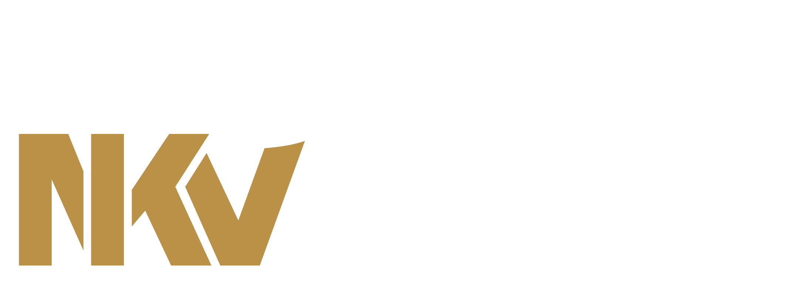

# Workshop Slides

## Sessions

- [Introduction](slides/1_welcome.html)
- [What is a reproducible project?](slides/2_reproducible_research.html)
- [GitHub without fear](slides/3_github_without_fear.html)
- [Quarto reports](slides/4_quarto_reports.html)
- [Collaboration](slides/5_collaboration.html)
- [Sharing data & code](slides/6_sharing.html)

{fig-align="center"}
