## **House keeping**

- Fire exits
- Toilets
- Lunch & Coffee

## Today is practical and hands-on

We will explore:

- Why reproducibility matters in ecology

- How open workflows improve collaboration

- GitHub + R + Quarto workflows

- Sharing code, data, and outputs

- Real examples from wildlife research

## Goal

Build workflows that are:

- Transparent

- Reusable

- Easier to maintain

- Easier to collaborate on

## Introduction [^1]

[^1]: [Some of the following slides are adapted from Erlend Nilsen's Into to OS](https://github.com/Open-Science-Course/OS-training-material/tree/main/introduction_OS)

::: {.callout-tip appearance="simple"}
*Open science is just science done the way science should be done....*
:::

*OR*

::: {.callout-tip appearance="simple"}
*In the future there will be science and closed science*

(i.e. - what we call open science today will in the future just be "science"....)
:::

## Open Science is an umbrella term

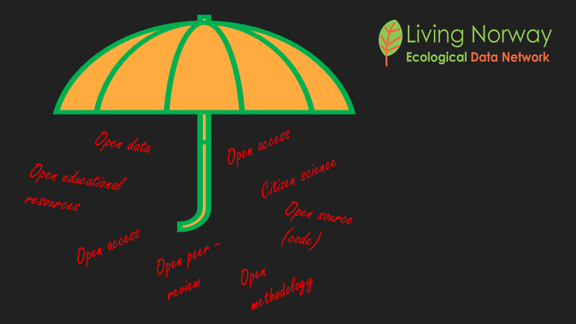

## But why bother?

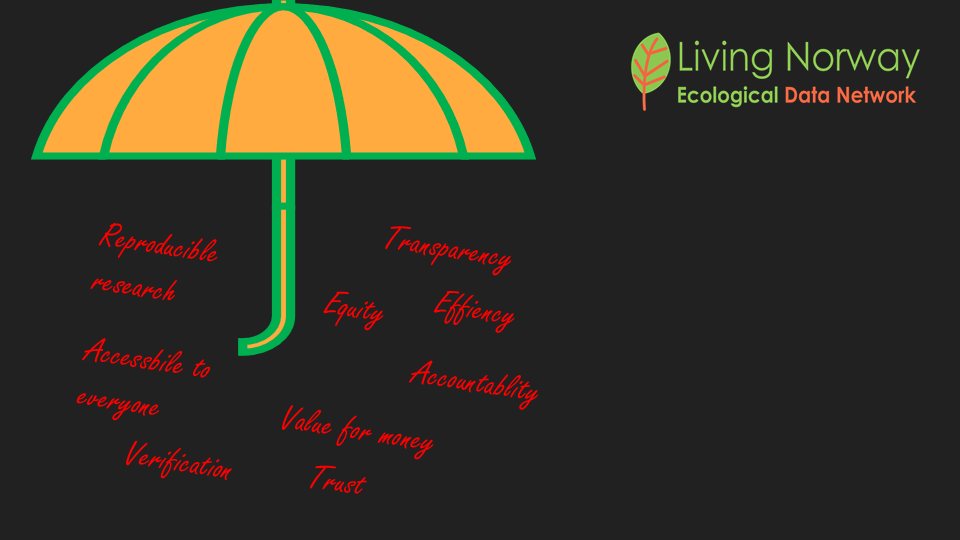{fig-align="center"}

## The six principles of open science

::::: columns
::: {.column width="50%"}
- Open methodology

- Open source

- Open data

- Open access

- Open peer review

- Open educational resources
:::

::: {.column width="50%"}

:::
:::::

## Different schools of open science

:::::: columns
:::: {.column width="50%"}
::: {.callout-note appearance="simple"}
- The *infrastructure school* (better infrastructure -\>better science)

- The *public school* (Science engage with society)

- The *measurement school* (Alt. measures of impact )

- The *democratic school* (knowledge free to all)

- The *pragmatic school* (Openness improves efficiency and quality)

See @Fecher2014
:::
::::

::: {.column width="50%"}

:::
::::::

## Topics for discussion

::: {.callout-caution appearance="simple"}
- *What do YOU associate with Open Science?*

- *How do you think Open Science can improve your project?*
:::

## The reproduciblity crisis

::::: columns
::: {.column width="50%"}
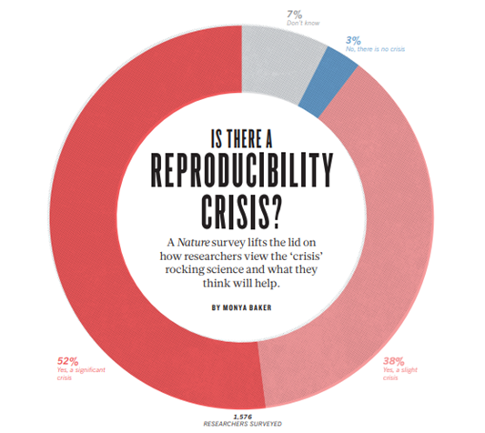
:::

::: {.column width="50%"}
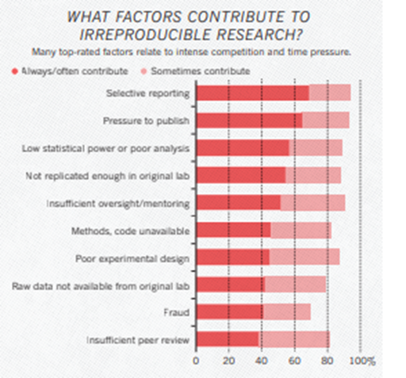
:::
:::::

[1,500 scientists lift the lid on reproducibility \| Nature](https://www.nature.com/articles/533452a)

## Access to data

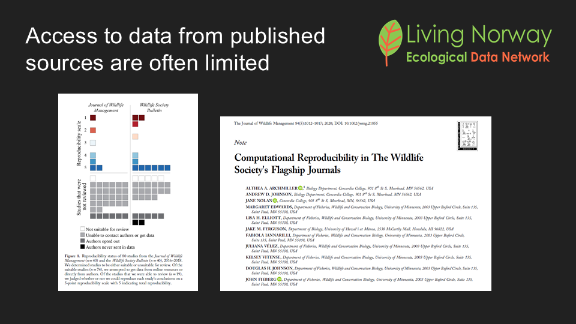

## 

::: {.callout-warning appearance="simple"}
- When we publish scientific papers it is expected that data is shared (archived) publicly (so that other researchers can reuse the data)

- However, currently we often find that this is not happening

  - See e.g. @Archmiller2020
:::

## 

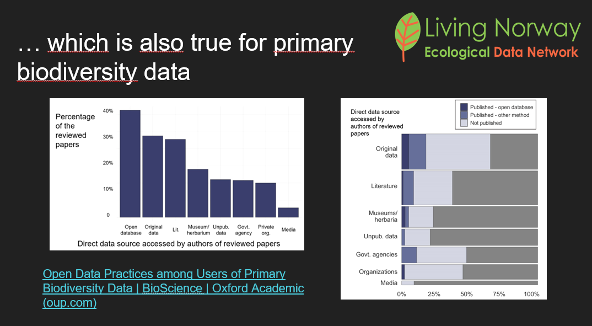

See @Mandeville2021 for details

## Access to code

:::::: columns
::: {.column width="50%"}
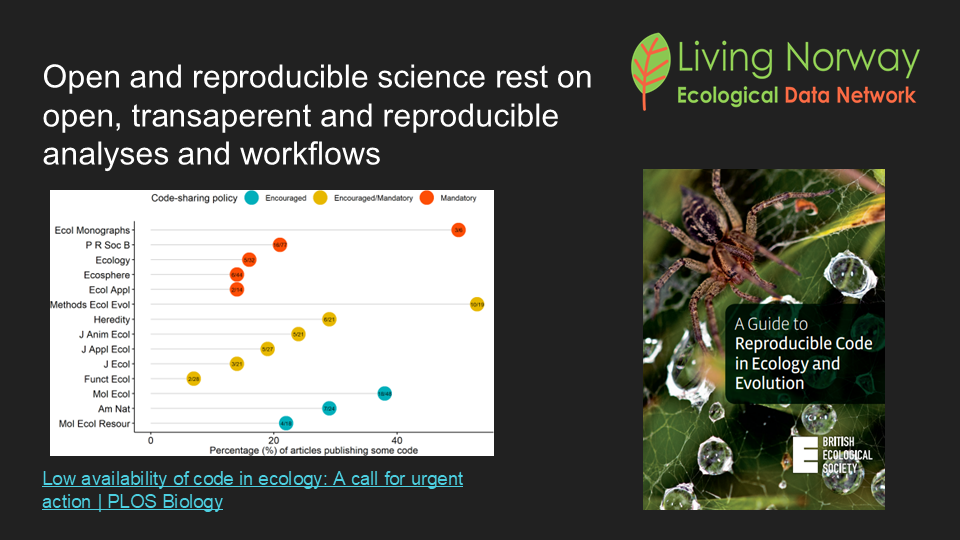
:::

:::: {.column width="50%"}
::: {.callout-warning appearance="simple"}
- When we publish scientific papers - we are expected to share (archive) R-code (or other code we are using to produce the reported results).

- Again - there is room for improvement!

  - See e.g. @Culina2020
:::
::::
::::::

## FAIR!

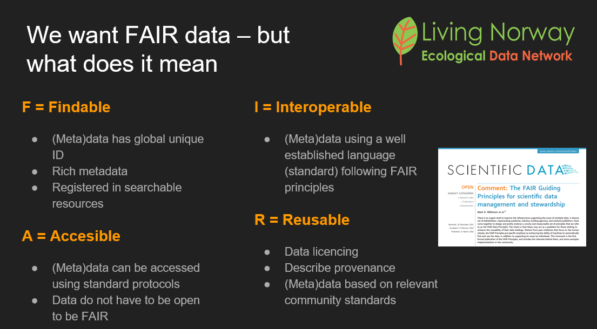

See @Wilkinson2016

## Questionable Research Practices

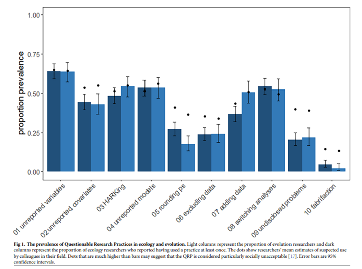

See @Fraser2018 for details and further discussion!

## The preregistration revolution!

::::: columns
::: {.column width="50%"}
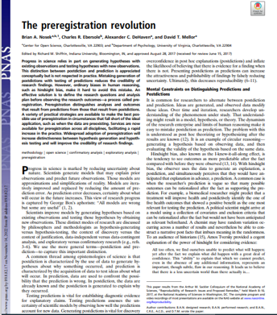
:::

::: {.column width="50%"}
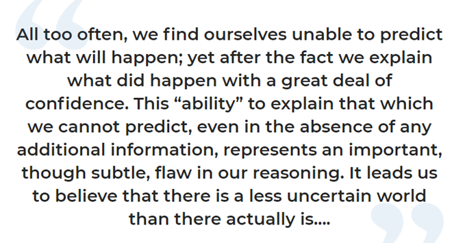

See @Nosek2018
:::
:::::

## Distinguish between exploratory and confirmatory science

::::: columns
::: {.column width="50%"}
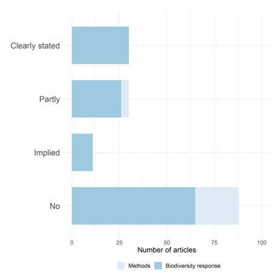
:::

::: {.column width="50%"}
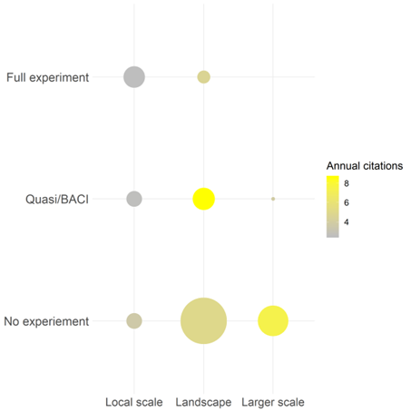
:::
:::::

See @Nilsen2020

## Open science is just as much about....

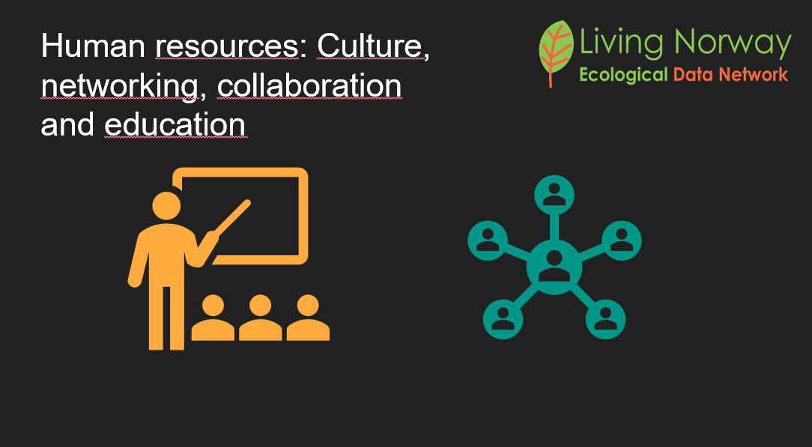

## References
